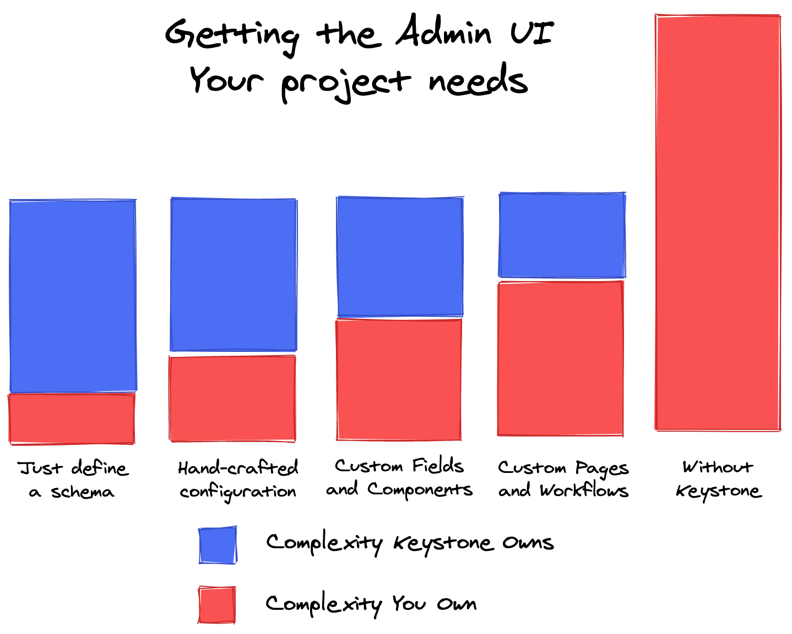
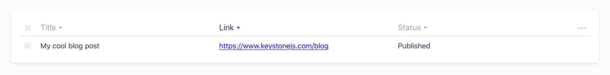

<!--[meta]
section: blog
title: Roadmap update - how we're making Keystone more intuitive and powerful
date: 2020-09-17
author: Jed Watson
order: 1
[meta]-->

> Long story short, we're building new interfaces for Keystone (both the API kind and the Admin UI kind) to make it easier to get started, easier to customise and extend, and easier to maintain.
>
> We'll be working on these alongside the stable interfaces — this is an upgrade, not a reboot — and are expecting a smooth transition when they are ready.
>
> What? Why? How? ... read on.

At Thinkmill, we've been thinking hard about what we want Keystone to become, and reflecting on how far it has come since we launched v5 two years ago.

Keystone is in a better place than it's ever been, and we're loving the enthusiastic feedback we've had from the community (as well as our own team who use it). We've also heard the pain points that people experience, and want to tackle these head on.

In particular, while we're happy with Keystone's core architecture and how the back-end has developed, now we want to pour more love into Keystone's Admin UI and focus on the getting started experience.

## Making getting started easy

One of the core philosophies of Keystone is "Make simple things easy, and complex things possible". Overall, we feel that we have been doing a good job of the second, but falling a bit short on the first.

So we're fixing this. We've been looking at other projects with great starting experiences, including Next.js and Gatsby — two favourites of ours which support really complex use-cases, but still make it ridiculously easy to get started.

Improving this means revisiting how Keystone is configured. Our API has grown somewhat organically, and we believe that by cleaning it up we can make Keystone more intuitive, and more powerful.

We've designed clear stepping stones in terms of different modes of configuration, which in our experience, maps to the maturity of a Keystone project. Early on, you want as much done _for_ you as possible; then over time you want to gradually take control of the parts of the system that are important (and unique) to your project.

For the Admin UI, it looks like this:



Having this clarity lets us design the best way to solve for different customisation modes, from controlling built-in behaviour with configuration, to replacing specific components in the admin UI, or add hooks into the database interactions, through to making entirely new pages in the Admin UI and having custom GraphQL queries and mutations you have created yourself.

We've felt the pain before of frameworks that make you feel like a rockstar at the start of a project, only to catch around your ankles and trip you up in later sprints. In the worst case, you hit a wall and realise you're going to rewrite everything (or you want to, but can't afford it, and live with the compromise).

Our goal for Keystone is to flatten that curve, as projects mature from Prototype → MVP → Production → Scale, and we're really excited about the idea we might finally achieve it!

## Replacing apps with config

We've found that configuring Keystone as a series of "apps" (which are effectively express middleware) introduces a lot of runtime complexity to projects. This has made understanding how to customise things like session management, and how to host Keystone projects, harder than it needs to be.

So we're introducing a new CLI + Config system to Keystone, inspired by Next.js. You'll still be able to use Keystone in advanced setups like you currently can, but simpler things will be easier, and having static config (that doesn't have side effects like starting a web server) will let us build some cool things in the future like schema analysis for database migrations, serverless builds, and more.

## Rethinking the Admin UI

The Admin UI is how most users experience Keystone, so it needs to be great by default, and extensible. At the moment, it does what it needs to, but we can make it so much better.

A number of key features (including our permissions framework) were developed after the current Admin UI was first architected. This means the codebase is already quite complex, and yet we still need to add more features!

To free ourselves up from this, alongside the new config and build system, we're re-architecting the Admin UI to reduce the complexity and bake in some important foundations (like permissions awareness, customisation and extensibility) in from the start.

We're not going to be changing the design significantly, but we will be tweaking it as we go so that the default experience is nicer and better for everyone.

The big change is that we're leaning in on code-gen; starting Keystone will now build a Next.js app for the Admin UI that you can build, run and deploy independently of Keystone's core.

But this is mostly about making way for something really important...

## Customising the Admin UI

Finally! The thing we're really excited about!

While it's possible to customise the admin UI as it stands, doing so is ... cumbersome. We want to make this flexibility both deeper and easier. This starts with the new Field Config. Each field will now have an `admin` option, which, allows you to specify how the admin UI works.

This is designed to scale - want to hide a field in the `create` view? There's an easy option for that. Want a field to appear as read-only based on user access? Or be hidden based on other state in the form? You'll be able to express that logic with functions.

Most importantly though, both lists and fields will have an option for `views`. Views allow you the ultimate customisability - provide a path for where your front-end code for this field lives, and we will load your views.

A simple example: if you are writing a link field that's text, but want to render it as a link in the table in the list view, you could add the following config:

```tsx
fields: {
  link: text({
    views: './admin/fieldViews/link',
  }),
}
```

Then, write a custom Cell view in React:

```tsx
import Link from 'next/link';

export const Cell = ({ item, path }: CellProps) => {
  return (
    <Link href={item[path]}>
      <a>{item[path]}</a>
    </Link>
  );
};
```



This allows you to customise different parts of the Admin UI without needing to create an entire new page to direct people to.

In addition, we are building a new design system for Keystone developers, to make extending parts of Keystone's UI without changing the look and feel seamless.

## How are we doing all this?

When looking at all this, we wanted to make sure we could deliver the best solutions possible, in the most effective ways. We spiked out our ideal implementations for these, and we've been happy enough with how that work has gone that we want to bring that back into the main repository. We'll be moving these in as new packages, and then shifting them across to be the canon Keystone API once we've hit feature parity on everything.

These new packages will remain experimental a little while longer, and we'll be going into more details about all of the new features in future posts, along with a detailed upgrade guide when we are ready for you to jump on board with these changes.

## One more thing: TypeScript

Intellisense is really good. Even when you don't use types in your project, the ability for editors like VS Code to know about types can still speed up development significantly.

Keystone exposes enough complicated types that this is something we knew we wanted to deliver, so all of our new interfaces will be written in typescript. Don't worry, if you don't want to use TypeScript, you still don't have to. But hopefully autocomplete will still make your life easier.

## Follow Along

We're really excited to share our work as we progress, and we'd love to hear from you. Watch for [PRs](https://github.com/keystonejs/keystone/pulls?q=is%3Apr+label%3A%22new+interfaces%22) and [issues](https://github.com/keystonejs/keystone/issues?q=is%3Aissue+label%3A%22new+interfaces%22+) coming in tagged `new interfaces`, and start [discussions](https://github.com/keystonejs/keystone/discussions) in the GitHub repo to share your thoughts with us.

We'll be blogging about these changes in depth as we progress, and as always you should [follow **@KeystoneJS** on Twitter](https://twitter.com/keystonejs) for updates!
