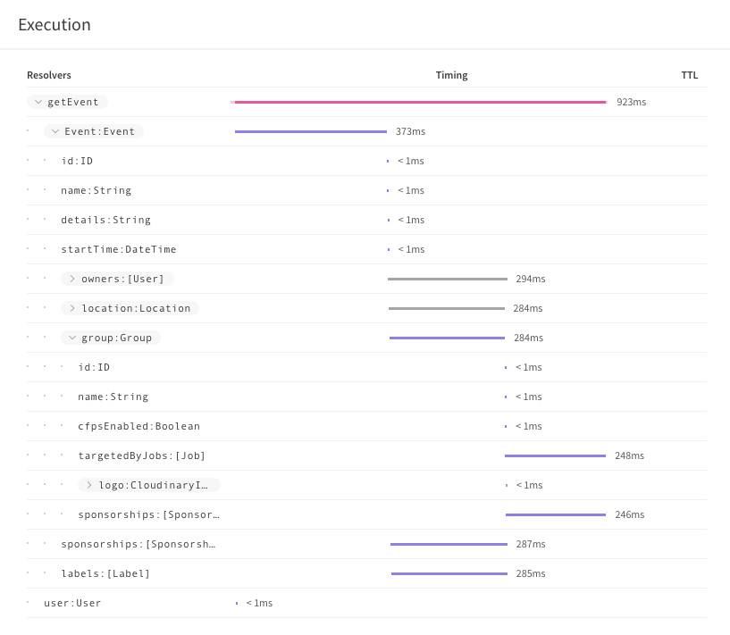
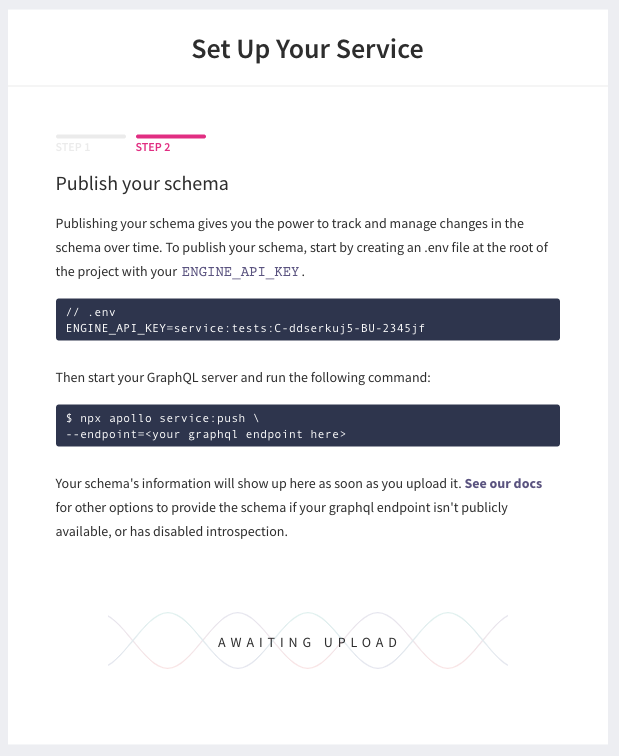
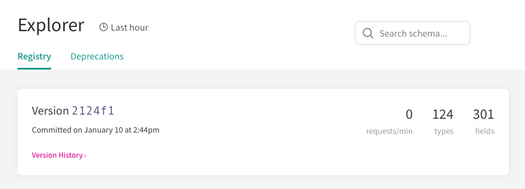
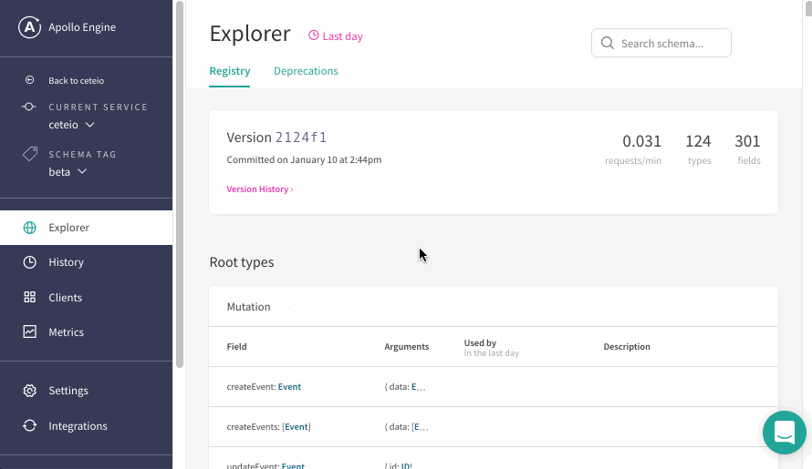

<!--[meta]
section: discussions
title: Performance
[meta]-->

# Performance

## Query Performance Monitoring with Apollo Engine

The GraphQL stack in keystone-alpha is powered by [Apollo Server](https://www.apollographql.com/docs/apollo-server/),
which comes with performance monitoring built in via the [Apollo Engine](https://engine.apollographql.com).

Apollo Engine provides a free service up to 25 million monthly requests,
including:

- Query logging
- Error logging
- Query performance monitoring
- Query performance tracing
- Schema version history



### Setting up Apollo Engine

#### Apollo Engine Account

Sign up for an [Apollo Engine](https://engine.apollographql.com) account.

Follow the prompts to create a new _service_.
On the second step, you will see a screen such as:



Ignore the `npx apollo service:push` command for now,
we'll need to upload the schema a slightly different way to account for any
[Access Control](./access-control.md) you may have setup.

#### Config

Create the `.env` file as suggested:

```.env
ENGINE_API_KEY=service:tests:C-ddserkuj5-BU-2345jf
```

_(👆 that's not a real key!)_

Create a file `apollo.config.js`:

```javascript
module.exports = {
  service: {
    localSchemaFile: './schema.graphql',
  },
};
```

#### Push Schema To Apollo Engine

We will use the `keystone.dumpSchema()` command to create a schema we can upload
to Apollo Engine.

Somewhere in your main Keystone application code you will be calling
`keystone.createList()`, followed by a call to `new WebServer(keystone, { ... })`.
We will now add some extra commands between these two calls:

```javascript
keystone.createList('Foo', {
  /* ... */
});

// ---- Schema dumping ----
if (typeof process.env.DUMP_SCHEMA === 'string') {
  keystone.dumpSchema(process.env.DUMP_SCHEMA);
  console.log(`Schema dumped to: ${path.resolve(process.env.DUMP_SCHEMA)}`);
  process.exit(0);
}
// ---- End Schema dumping ----

const server = new WebServer(keystone, {
  /* ... */
});
```

Next, start the Keystone server but include a `DUMP_SCHEMA` environment variable.
This will output the Keystone schema to the given path
(ready for us to upload to Apollo Engine!):

```shell
DUMP_SCHEMA=./schema.graphql node index.js
```

_Note `./schema.graphql` is the same path we set in `apollo.config.js`_

`schema.graphql` should look something like:

```graphql
scalar Upload
scalar DateTime

input GroupRelateToOneInput {
  # ...
}

# ... And so on
```

Now we can push our generated schema to Apollo Engine with the command:

```shell
npx apollo service:push
```

_(Note: For performance and security reasons,
you may wish to add `apollo` to your devDependencies,
and add the command above to your `package.json` without the `npx` prefix)_

Wait for Apollo Engine to show the newly uploaded service:



#### Send stats to Apollo Engine

Ensure your application is reading `.env` environment variables on boot.
We recommend the [`dotenv`](https://www.npmjs.com/package/dotenv) library for this:

```shell
node -r dotenv/config index.js
```

_(Note: you do not need the `DUMP_SCHEMA` environment variable when starting the
server - it is only used for exporting an updated schema and should not be set
when trying to start the Keystone GraphQL API)_

Apollo Server will read the `ENGINE_API_KEY` env var and start sending graphQL
stats to Apollo Engine.

Within seconds of triggering graphQL requests, they will begin to show in Apollo
Engine:



#### Tweaking stats sent to Apollo Engine

The `WebServer` config option can accept an `apollo` key for setting different
options, one of which can be used to configure the Apollo Engine connection:

```javascript
const server = new WebServer(keystone, {
  /* ... */
  apollo: {
    engine: {
      privateVariables: ['password'],
    },
  },
});
```

See [the Apollo Server docs](https://www.apollographql.com/docs/apollo-server/api/apollo-server.html#EngineReportingOptions) for more options.
