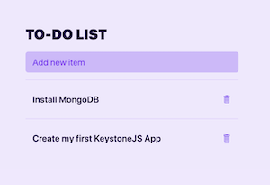
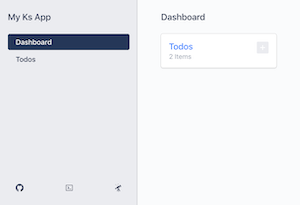
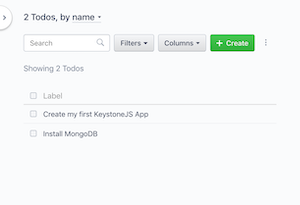

<!--[meta]
section: quick-start
title: Introduction
[meta]-->

# Quick Start

## Welcome

This quick start guide will get you up and running with a fresh new KeystoneJS application in just a few easy commands.

With just _5 minutes_, this is what you're going to build:

[](https://raw.githubusercontent.com/keystonejs/keystone-5/master/docs/quick-start/img/todo.png)

[](https://raw.githubusercontent.com/keystonejs/keystone-5/master/docs/quick-start/img/admin-dashboard.png)

[](https://raw.githubusercontent.com/keystonejs/keystone-5/master/docs/quick-start/img/admin-list.png)

## Requirements

Please make sure your computer/server meets the following requirements:

- [Node.js](https://nodejs.org/) >= 10.x: Node.js is a server platform which runs JavaScript.
- [MongoDB](../quick-start/mongodb.md) >= 4.x: MongoDB is a powerful document store.

## Installation

To create a new KeystoneJS application, ensure [mongodb is running](../quick-start/mongodb.md) and then run the following commands.

```sh
yarn create keystone-app my-app
cd my-app
npm start
```

Congratulations, you are now running your very own KeystoneJS application!
To visit your running application (a simple todo list), visit

<pre>
	<code>
		<a href="http://localhost:3000">http://localhost:3000</a>
	</code>
</pre>

Your application also has an Admin UI, which lets you directly manipulate the data in your database

<pre>
	<code>
		<a href="http://localhost:3000/admin/">http://localhost:3000/admin</a>
	</code>
</pre>

Both your application and the admin UI are powered by a GraphQL API.
KeystoneJS provides a web interface for this API at

<pre>
	<code>
		<a href="http://localhost:3000/admin/graphiql">http://localhost:3000/admin/graphiql</a>
	</code>
</pre>

## Up Next

- [Schema - Lists & Fields](../discussions/schema.md)
- [Using the KeystoneJS Admin UI](../tutorials/admin-ui.md)
- [Introduction To KeystoneJS's GraphQL API](../tutorials/intro-to-graphql.md)
