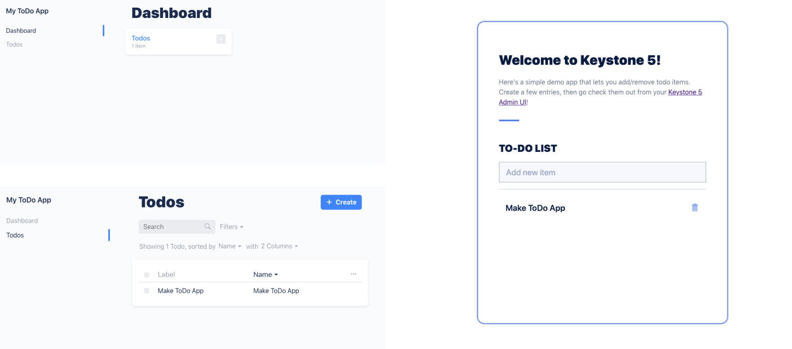

<!--[meta]
section: quick-start
title: Getting Started
order: 1
slug: /quick-start/
[meta]-->

# Getting Started

## Your first KeystoneJS app in 5 minutes.

This quick start guide will get you up and running in just a few minutes. Let's build a simple todo app with a fresh install of Keystone 5!



<br/>

## Requirements

Before we start, check that your computer or server meets the following requirements:

- [Node.js](https://nodejs.org/) >= 10.x: Node.js is a server platform which runs JavaScript.

And ONE of the following databases:

- [MongoDB](https://www.mongodb.com/) >= 4.x: MongoDB is a powerful NoSQL document storage database.
- [Postgres](https://www.postgresql.org) >= 9.x: PostgreSQL is an open source relational database that uses the SQL language.

Finally, make sure [your database is configured and running](/docs/quick-start/adapters.md).

All set? Great, let's get started!

## Installation

To create a new KeystoneJS application, run the following commands in your terminal:

```sh
npm init keystone-app my-app
```

or with yarn:

```sh
yarn create keystone-app my-app
```

You'll be prompted with a few questions:

1. **What is your project name?** Pick any name for your project. You can change it later if you like.
2. **Select a starter project.** Select the `Todo` application if you wish to follow this guide.
3. **Select an adapter.** We'll go more into database adapters later. For now, simply choose `Mongoose` if you're running a MongoDB database and `Knex` if you're running a Postgres one.

Wait a few minutes for all the project dependencies to install. Once that's finished, run this:

```sh
cd my-app
npm run dev
```

## Congratulations! 🎉

You are now running your very own KeystoneJS application! Here's what you get out of the box:

### A simple todo application

Your app is up and running at the following URL:

<pre>
	<code>
		<a href="http://localhost:3000">http://localhost:3000</a>
	</code>
</pre>

### An Admin UI for content management

Your application also has an Admin UI, which lets you directly manipulate the data in your database:

<pre>
	<code>
		<a href="http://localhost:3000/admin/">http://localhost:3000/admin</a>
	</code>
</pre>

### A GraphQL API

Both your application and the admin UI are powered by a GraphQL API.
KeystoneJS provides a web interface for this API at this URL:

<pre>
	<code>
		<a href="http://localhost:3000/admin/graphiql">http://localhost:3000/admin/graphiql</a>
	</code>
</pre>

## What next?

This todo app is a good introduction to KeystoneJS, but chances are you'll want to build something a bit more complex and secure than that!

The [guides section](/docs/guides) is a great next step. It will walk you through concepts like
[creating lists](/docs/guides/add-lists.md),
setting up [content relationships](/docs/guides/relationships.md),
managing [Access control](/docs/guides/access-control.md) and much more.
