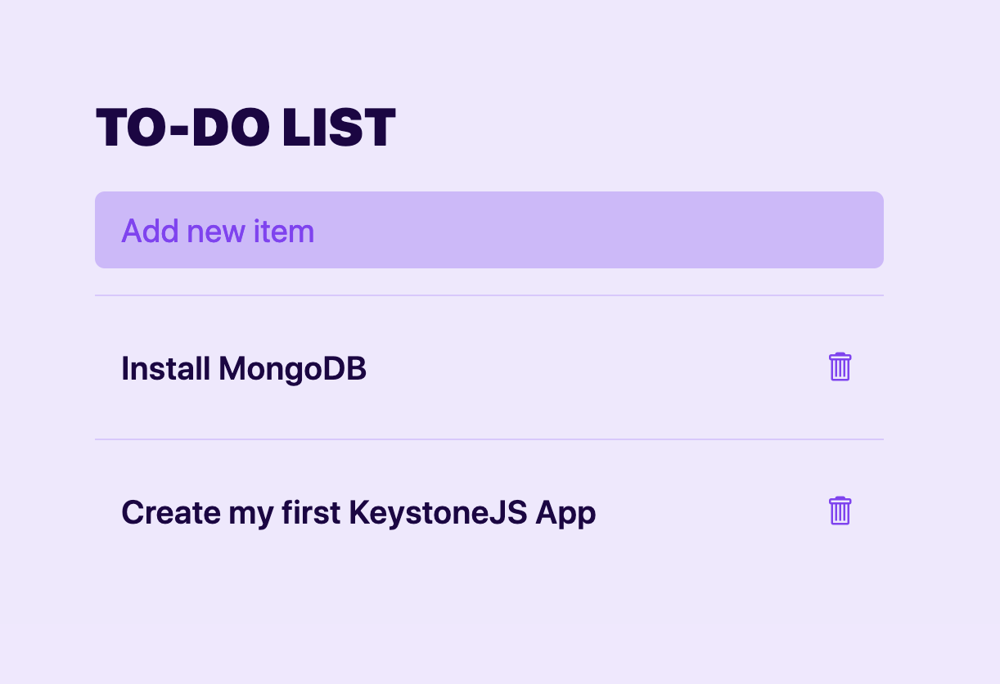
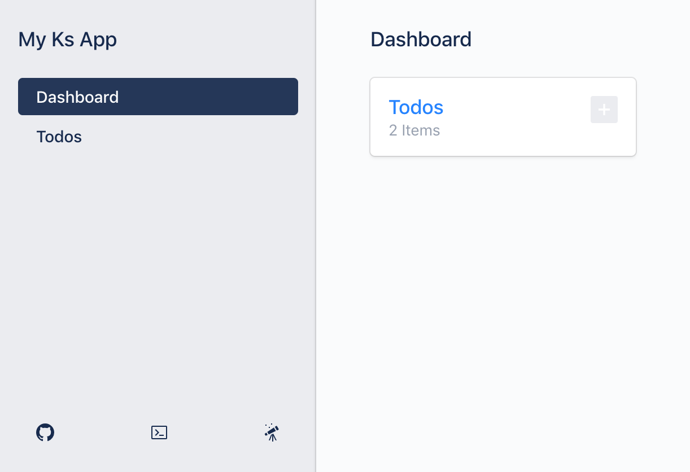
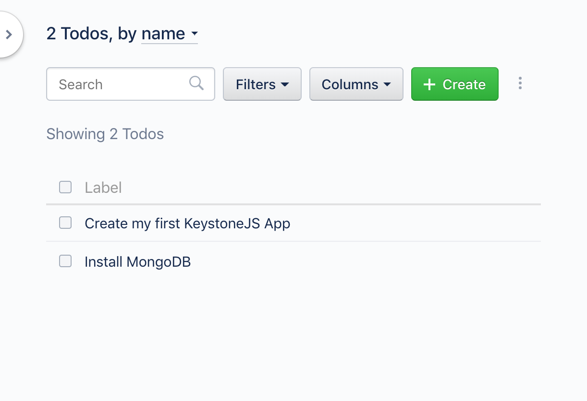

# Quick Start

## Welcome

This quick start guide will get you up and running with a fresh new Keystone application in just a few easy commands.

<center>
  <a href="./img/todo.png" target="_blank">
    
  </a>
  <a href="./img/admin-dashboard.png" target="_blank">
    
  </a>
  <a href="./img/admin-list.png" target="_blank">
    
  </a>
</center>

## Requirements

Please make sure your computer/server meets the following requirements:

- [Node.js](https://nodejs.org/) >= 10.x: Node.js is a server platform which runs JavaScript.
- [MongoDB](../quick-start/mongodb.md) >= 4.x: MongoDB is a powerful document store.

## Installation

To create a new KeystoneJS application, run the following commands.

```sh
npx create-keystone-app my-app
cd my-app
npm start
```

Congratulation, you are now running your very own Keystone application!
To visit your running application (a simple todo list), visit

<pre>
	<code>
		<a href="http://localhost:3000">http://localhost:3000</a>
	</code>
</pre>

Your application also has an admin UI, which lets you directly manipulate the data in your database.

<pre>
	<code>
		<a href="http://localhost:3000/admin/">http://localhost:3000/admin</a>
	</code>
</pre>

The [Admin UI Tutorial](../tutorials/admin-ui.md) will walk you through the functionality provided by the Admin UI.

Both your application and the admin UI are being powered by a GraphQL API.
Keystone provides a web interface for this API at

<pre>
	<code>
		<a href="http://localhost:3000/admin/graphiql">http://localhost:3000/admin/graphiql</a>
	</code>
</pre>

The [Introduction To GraphQL](../tutorials/intro-to-graphql.md) tutorial will guide you through the basics of using GraphQL to interact with your Keystone system.
