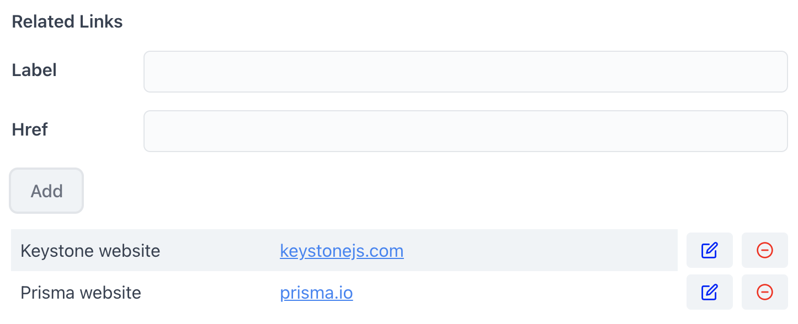

## Feature Example - Custom Field View

This project demonstrates how to create a custom field view for a JSON field. This custom field view allows users to add, edit and remove navigation items from a list

## Instructions

To run this project, clone the Keystone repository locally then navigate to this directory and run:

```shell
yarn dev
```

This will start the Admin UI at [localhost:3000](http://localhost:3000).

You can use the Admin UI to create items in your database.

You can also access a GraphQL Playground at [localhost:3000/api/graphql](http://localhost:3000/api/graphql), which allows you to directly run GraphQL queries and mutations.

## Features

In this project we add a new JSON field to the `Task` list:

```typescript
relatedLinks: json({
  ui: {
      views: require.resolve('./fields/related-links/components.tsx'),
      createView: { fieldMode: 'edit' },
      listView: { fieldMode: 'hidden' },
      itemView: { fieldMode: 'edit' },
  },
}),
```

This field defines `ui.views` and provides a custom editor component which allows users to view and edit this field in a more intuitive way than just using raw JSON.

The stored JSON data:

```json
{
  "data": {
    "allTasks": [
      {
        "relatedLinks": [
          {
            "label": "Keystone website",
            "href": "keystonejs.com"
          },
          {
            "label": "Prisma website",
            "href": "prisma.io"
          }
        ]
      }
    ]
  }
}
```

will be rendered as.

<div align="center">
  
</div>
